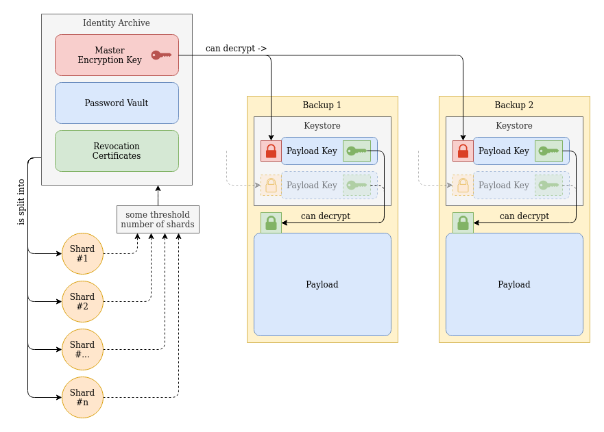

# Shard medium #1

On this storage device, you will find **one** of multiple shards required to reconstruct my [identity archive](#identity-archive). You need 2 out of 4 shards to perform this restoration.

## Table of contents

- [Table of contents](#table-of-contents)
- [Explanation](#explanation)
    - [Overview](#overview)
    - [Identity Archive](#identity-archive)
        - [Master Encryption Key](#master-encryption-key)
        - [Password vault](#password-vault)
        - [Revocation certificates](#revocation-certificates)
    - [Shards](#shards)
    - [Backups](#backups)
- [Restoring the archive](#restoring-the-archive)
    - [Ensuring shard integrity](#ensuring-shard-integrity)
    - [Combining shards](#combining-shards)

## Explanation
This archive, if reconstructed successfully, contains:


Due to the sensitive nature of this data, I do not wish to give any _single_ person the power to access all of my data and my digital identity.

For this reason, my identity archive is **split up** into several **shards**.

You should **not** be attempting to reconstruct my identity archive without my **explicit** consent, with the sole exception being when I have passed away.

> I repeat: do **not** reconstruct this archive **unless I have passed away**.

## Overview

To gain a better understanding of how this all works, please look at the diagram below:



Illustrated here is what the Identity Archive consists of and how it works.

### Identity archive

My identity archive contains all data that I deem crucial to my online and digital presence:
- My **master encryption key**;
- My entire **unlocked** password vault;
- Revocation certificates for my online identity.

Full details on the contents **and how to use them** are included **inside** the archive.

### Shards
The identity archive is split into several **shards**. These shards have a special property: you do **not** need posession of _all_ shards to restore the original data, you simply need to meet the _threshold_. There are 4 shards, of which you need at least{threshold} shards in order to perform a successful recovery.

### Backups
Although the structure of backups may a little daunting in the [overview](#overview), they really aren't that complex. However; they are not the topic of this document. A full explanation on backups and how they work can be found **on the backup media themselves**.

## Restoring the archive
In order to restore the [identity archive](#identity-archive), 

## Ensuring shard integrity
Prior to attempting to reconstruct the identity archive, I urge you to **verify the integrity** of the data on this storage medium. This prevents any problems from occurring in later steps.

### Requirements
- A machine running Linux;
- `par2cmdline` installed.

### Validating & repairing the shard
Once you have all the requirements, open a terminal and run the following:
```
$ bin/parfix key/*
```
This will instruct `par2` to fix any errors it finds in the shard file.

## Combining shards
After you have [ensured the shard integrity](#ensuring-shard-integrity) and are in posession of **multiple shards**, you can restore the archive.

### Requirements
- A machine running Linux;
- `ssss` installed.

### Restoring the archive
Assuming multiple shards are stored in the current folder, run the following command:
```
$ bin/filemerge mykey
```
